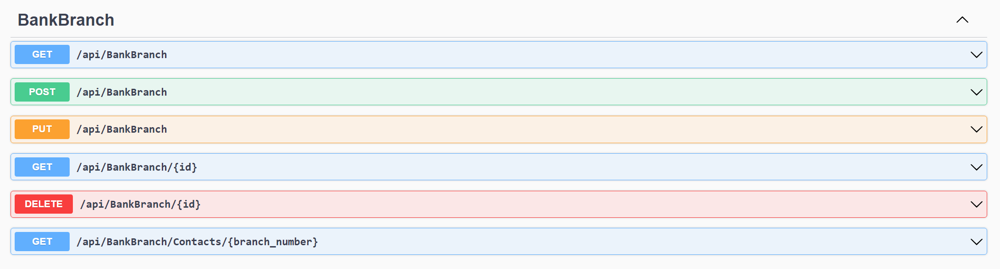
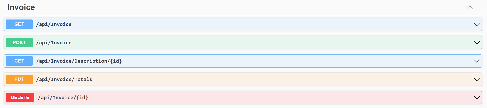
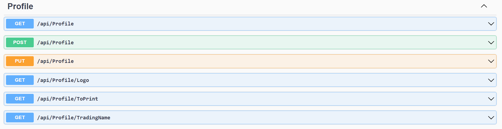
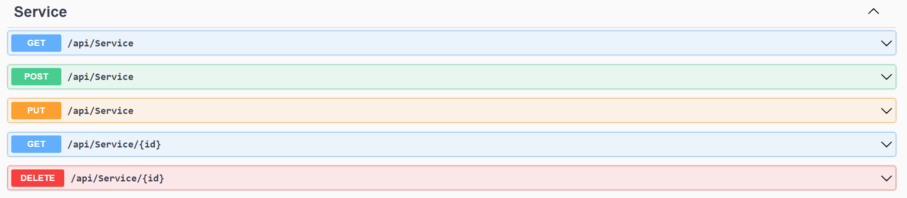
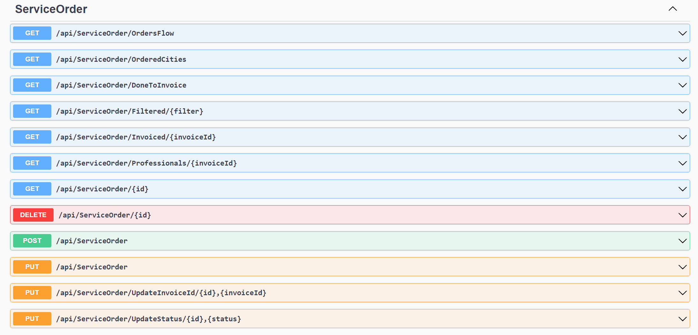

# Fluxus API

API Rest desenvolvida para integrar as operações de manipulação e persistência de dados do software Fluxus (gestão de serviços de engenharia para credenciados de bancos públicos) com a base de dados em MySQL.

---

## Tecnologias

* C# (.NET 6);
* MySQL;
* Dapper;
* Swagger.

## Versão

* v2

## <i>Endpoints</i>

## Autor

Felipe Ferreira Gandra

fgandraf@gmail.com
